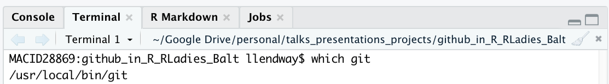
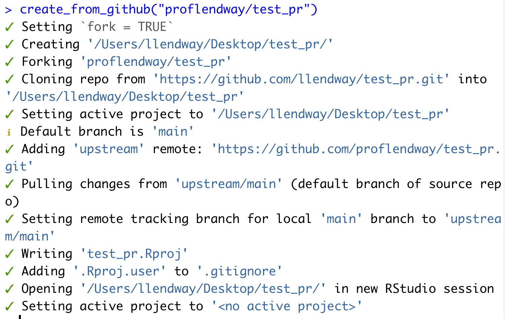
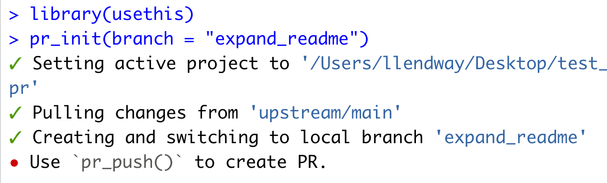
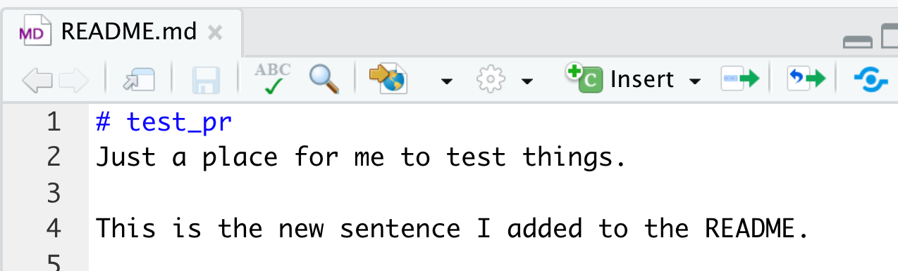
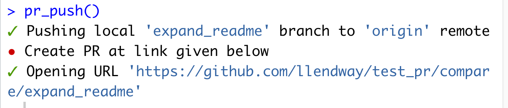
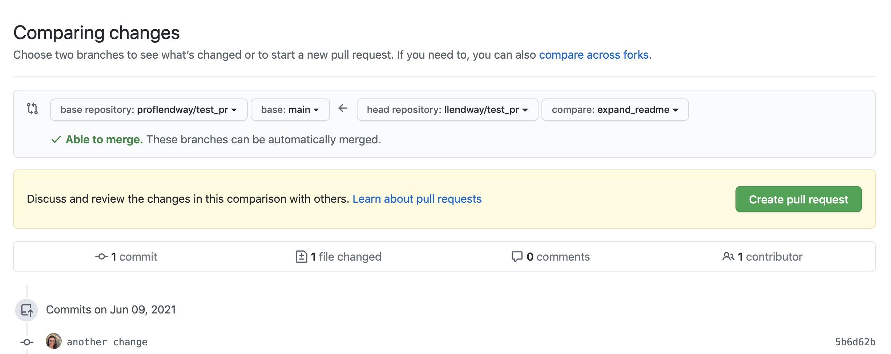
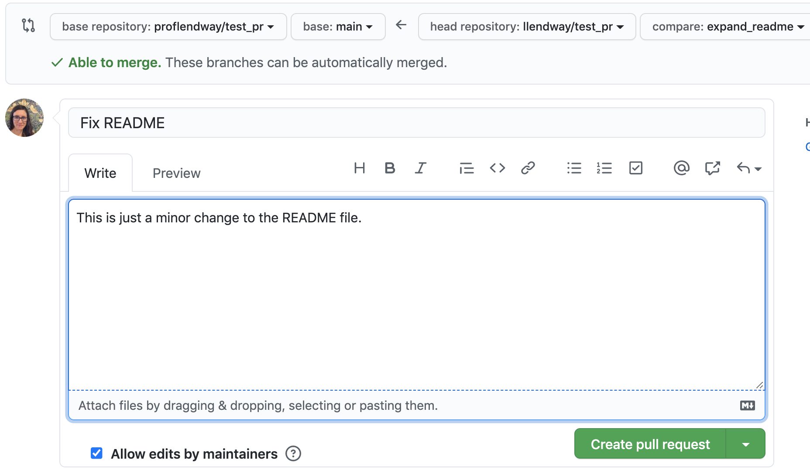
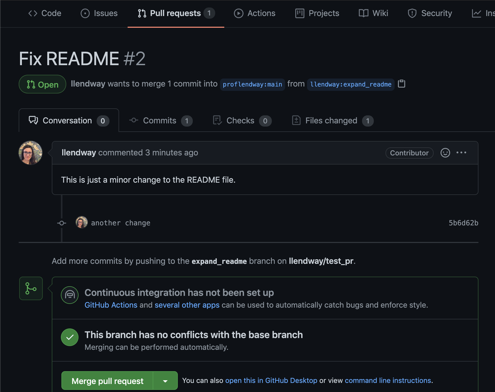

## WARNING!!!

I am NOT a Git/Github expert!

<center>

<div class="tenor-gif-embed" data-postid="21632152" data-share-method="host" data-width="40%" data-aspect-ratio="1.0"><a href="https://tenor.com/view/im-no-expert-saturday-night-live-im-not-apro-im-not-an-expert-iam-not-that-expert-with-it-gif-21632152">Im No Expert Saturday Night Live GIF</a> from <a href="https://tenor.com/search/imnoexpert-gifs">Imnoexpert GIFs</a></div><script type="text/javascript" async src="https://tenor.com/embed.js"></script>

</center>

## But I want to learn!

* I want to share code with others so they can use it.  
* I want my code backed up somewhere other than on my computer.  
* I hate keeping track of different versions of code and other files.  
* I also hate the terminal so will try to avoid it at any cost.

Git/Github can help us with this! How many of you already use Git/Github? 

## Why learn this from me?

* Git/Github were really intimidating to me at first - they still are!  
* I didn't feel like I had a place where I could try things out and make mistakes.  
* When things didn't work out the way they showed in online resources, I had no idea what to do!  

I hope to give you a comfortable format to try things and learn. Please, ask questions and interrupt when I do something too quickly or that you don't fully follow. There are no stupid questions!

## Some libraries

If you don't have these libraries installed already, you can start doing that now. You will definitely need the first 2 libraries. The others may not be necessary.


```r
library(usethis) # for nice interactions with Git/Github
library(gitcreds) # for functions that help set up a PAT
library(gert)
library(credentials)
library(gh)
```


## Getting set up - Github account

Created an account on https://github.com/.

I may not need to tell you this, but choose a "nice" username. Something that you often use and that incorporates part of your name. Definitely something you will be ok revealing to a future boss. 


## Getting set up - Install & configure Git

Check to see if you already have Git installed by typing the following in the shell/terminal.

    ```
    which git
    ```
    
    If this returns something like
    
    ```
    /usr/bin/git
    ```
    
    then you are finished and don't need to install Git. On a Windows machine,     you may not even be able to type the `which git` command successfully. 
    
    

## Getting set up - Install Git (if need be)

**On a Windows:**

  * Install [Git for Windows](https://gitforwindows.org/). When asked about “Adjusting your PATH environment”, make sure to select “Git from the command line and also from 3rd-party software”.  
  * R Studio for Windows prefers for Git to be installed below C:/Program Files and this appears to be the default. Unless you have specific reasons to otherwise, follow this convention.
  
**On a Mac:**

  * Go to the *shell/terminal* and enter **one** of these commands to elicit an offer to install developer command line tools. Accept the offer ... click on install.
  
    ```
    git --version
    git config
    ```

  * Some of you on a Mac may need to do the following in the *terminal* if you try to open a project unsuccessfully. You'll find out if this is the case in a moment.
  
    ```
    xcode-select --install
    ```

## Getting set up - Configure Git

If you haven't already, you'll need to install the `usethis` library and load it. Run the following code in the *console* with some minor changes. The `user.name` is your Git username. This can be different from your GitHub username, although it might be a good idea to just keep it the same. The `user.email` *MUST* be the same as your GitHub user email. 

```
use_git_config(user.name = "Jane Doe", user.email = "jane@example.org")
```

## Getting set up - personal access token

A PAT, or Personal Access Token, is now necessary in order for RStudio and GitHub to talk to one another.

1. Run the `create_github_token()` function from the `usethis` library in the console. This will take you to the GitHub website where you can create a token - store that somewhere safe and don't lose it! You'll need it in a moment and maybe sometime in the distant future.  
2. Install the `gitcreds` package in RStudio and load the library using `library(gitcreds)` (you can do that in the console).  
3. Run the `gitcreds_set()` function in the console. If you are given options, choose the option to Replace these credentials and then paste in your PAT that you just created in the previous step.  
4. When you next commit and push, it may still ask you for your github username and password, **use your PAT when it asks for your password!!** (we'll get to committing and pushing in a moment).


## Create and clone a repo! 

Find detailed images of this process [here](https://github.com/llendway/github_for_collaboration/blob/master/github_for_collaboration.md).

1. Create a repo on https://github.com/. After you login, you should see a little icon in the upper right-hand corner. Mine is an image of me. If I click on that a drop-down appears and I can choose "Your repositories". Do that.

2. Click on the "New" button. Name your repository. Choose Public and check the box next to Add a README filend probably add a license (I usually choose MIT but do not trust me to explain any of the legality of this). Then click Create repository.

3. Clone the repo to your computer: click the green code button and copy the link, in R Studio File --> New Project --> Version Control --> Git --> Paste link and put it in the desired location. Click Create Project. This will open a new RStudio session. You should now see a Git tab (in upper right-hand corner by default) and there should be a .Rproj file and .gitignore file there.

We will do these steps together!

## Commit and Push

Think of cloning a repo as "copying" the repository to your computer. But when it does the copying, it keeps the connection with the online repo. As we make changes to the files in our project on our computer, we can also make sure those changes are saved out to Github. Let's see how to do this. 

1. Open the README file and make a small change. You could just add a sentence. 
2. Save the file and you should see it show up in the Git tab. That means this file has been saved locally but the save hasn't been "documented" in Git or Github. 
3. Click the Commit button in the Git tab. Put a check in the box next to the README.md file under the word *Staged* (in the future, you can stage multiple files at the same time by checking the boxes next to multiple files) and **add a comment to the commit box**. Click commit. It will give you a message saying it is complete. The message may seem cryptic if you're not used to them. The change you made has now been committed to local memory, in the Git history (Click the Diff button in the Git tab and you can see the history of your commits). The changed file is only change on your computer, NOT online if you look at GitHub ... go check.  
4. Next, we are going to push those changes to GitHub by clicking the green up arrow in the Git tab. 


Were you prompted for a username and password? Try making another modification, committing, and pushing. Are you still prompted for a username and password? If so, go back and make sure you set up a Personal Access Token (PAT) and use that as the password. 


## Your turn!

1. Create a new .Rmd file and save it to your project folder/repository.  
2. Stage, commit, and push the new file to Github. Check out on Github to make sure everything you think should be out there is out there. 


## Using the terminal ... queue scary music

I don't like the terminal, but sometimes I'm forced to use it. When I have to do that, my palms get sweaty, and I sometimes close my eyes and peak through my fingers after hitting return while I wait in fear to see what sort of mistake I might have made. I've learned a few Git commands that I feel comfortable enough to share.

There's a video of me doing these same things here: https://lisalendway.netlify.app/posts/2021-02-24-gitinrstudio/#i-use-the-terminal-and-come-out-alive

## Using the terminal

This first one doesn't actually require the terminal (yay!).

You save a file, but don't want those changes. You can right-click on the file in the Git tab and choose revert. You can also choose diff to see how it has changed from its last version. This will change the file back to the previous commit. So, if you've saved a lot and not committed, that could be a lot of changes.

## Using the terminal

You committed something you didn't actually want to commit. Or maybe you committed something that's too large to push to Github (that's usually my mistake). So, I need to "un-commit", which means heading to the terminal. In the terminal, run `git reset HEAD~1` which will bring back all the files you just committed as if they were never committed - you may need to refresh the Git pane. 

Then, you can make the changes you want, even deleting a file, and re-commit.

## Using the terminal

This time you committed and pushed. You may have made additional commits that you DO NOT CARE ABOUT. To revert to an old commit, use `git revert --no-commit <SHA>..HEAD` in the terminal, where `<SHA>` is the alpha numeric string that defines that commit. You can find the `<SHA>` in the history (the clock icon) in the Git tab.

## Using the terminal

This time you committed something, pushed it, and made more commits along the way.

We can go back to a previous commit and keep our new commits by using `git revert <SHA>` in the terminal. This will likely lead to a merge conflict (which you can resolve in RStudio) or put you in the VIM window (I don't even know what that means) where you should push `:q` as quickly as possible to escape.

## Adding a collaborator

Now, let's explore how we can work with others on a project by adding a collaborator.

1. On https://github.com/, go to your repository page for the repository you just created. 
2. Choose Settings (the gear-like icon).  
3. Go to Manage access. 
4. Search for your collaborator's Github account and choose Invite a collaborator.  
5. They will get an email and must accept your invitation to collaborate. 
6. Once accepted, they will have equal access to everything in the repository.  
7. They should clone the repo to their computer. Make sure the initial person creates the Rproj first, otherwise you can run into weird issues.

## Adding a collaborator

Let's do this together! Would someone volunteer to be my collaborator?

## Adding a collaborator

Once we have our collaborator(s), we'll add some steps to our usual process. 

* When we reopen the project, Pull in new work! (the turquoise down arrow on the Git tab).
* Communicate!!! Talk to your collaborators about what you're working on and when. You'll likely run into issues if you all are collaborating on the same file at the same time. 

Which brings us to ....

## Merge conflicts! Arg!

If you and a collaborator are working on a file at the same time, you'll likely run into a merge conflict at some point. This means you've tried to push out new work, but in the mean time a collaborator has already pushed out more new work that you hadn't pulled in. Sometimes Git can resolve them on its own but often it can't.

When that happens, you need to resolve it by editing the file where the merge conflict occurred. You can see details of how to do that here: https://github.com/llendway/github_for_collaboration/blob/master/github_for_collaboration.md#merge-conflicts

Let's create a merge conflict together!


## Pull requests (PRs)

Once you're comfortable using these tools on your own and with some trusted collaborators, you may want to start making suggestions to other people's code - maybe add a feature in your favorite package or even just suggesting a typo fix in some documentation. That's a pull request! 

We are going to use the instructions here: https://usethis.r-lib.org/articles/articles/pr-functions.html

And we're going to make pull requests to a PR practice repo I created: https://github.com/llendway/pr_practice

## Pull requests (PRs)

We will need to load the usethis library. You should also have the gert, credentials, and gh packages installed. (If anyone gets an error like this: "Error in validate_gh_pat(new_gh_pat(x)) : A GitHub PAT must consist of 40 hexadecimal digits", update the gh package or reinstall, see [this post](https://community.rstudio.com/t/usethis-use-github-error-in-validate-gh-pat/105737)).


```r
library(usethis)
```


## Pull requests - fork and clone

You are going to fork and clone the repo. Forking is putting it in your own Github repo and cloning it puts it on your computer. This function also sets the upstream remote to the original repo. This example uses my "other" GitHub account, which is pretty much a garbage account for me to practice with. 


```r
create_from_github("proflendway/test_pr")
```

You can change the default location, using `destdir` argument. If you are making a PR to your own repo, it won't fork it (since you already own it).

## Pull requests - fork and clone

After you run the code, you will see something like this, and I new RStudio window will open with this project open.

{width="50%"}

## Pull requests - create branch

Next, we create a branch so changes we make take place outside of the main branch. In the `pr_init()` function, name your branch. Do this in the project that was just opened - you may need to reload the usethis library first.


```r
pr_init(branch = "expand_readme")
```

{width="70%"}

## Pull requests - change, commit

It may take a second for the new branch to show up in RStudio. Make sure you are in that new branch (it says you are but double check). Make a small change, save, and commit the file.

{width="70%"}


## Pull requests - submit it!

Once you're finished making changes, use the `pr_push()` function (no arguments) to push out the changes to your copy of the repo on github. That will open a Github page and sets you up to make a PR!

<div class="columns-2">

{width="95%"}

\
\
\


{width="95%"}

</div>

## Pull requests - message to maintainer

After creating the pull request, you can (and should!) write a message about the changes you are proposing.

{width="70%"}

## Pull requests - maintainer side

They could merge in Github, or [fancier things](https://usethis.r-lib.org/articles/articles/pr-functions.html#review-of-the-pull-request).

{width="60%"}

## Pull request

Let's do it!

We're going to make pull requests to a PR practice repo I created: https://github.com/llendway/pr_practice

## Resources

David Keyes's setting up Git/Github blog post: https://rfortherestofus.com/2021/02/how-to-use-git-github-with-r/

Setting up Git/Github and using it for collaboration: https://github.com/llendway/github_for_collaboration/blob/master/github_for_collaboration.md

Slides from my R Ladies Tunis talk: https://github.com/llendway/rladies_github_for_collab

My blog post, with video (thank you to my sister, Heather): https://lisalendway.netlify.app/posts/2021-02-24-gitinrstudio/

Happy Git with R by Jenny Bryan: https://happygitwithr.com/ - an amazing resource, especially after you're a little more comfortable with using Git and Github

The usethis Pull request helpers article: https://usethis.r-lib.org/articles/articles/pr-functions.html

Melanie Frazier's Guide, *GitHub: A beginner's guide to going back in time (aka fixing mistakes)*: https://ohi-science.org/news/github-going-back-in-time


